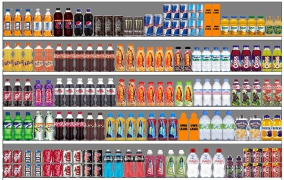

# nn-grocery-shelves
### Recognition of Product Positions on Shelf Images with Deep Learning in Keras / Tensorflow / Object Detection API



## Introduction

### What is a planogram?
- Visual description of the retail products' placement on shelves.

The solution is based on [Toward Retail Product Recognition on Grocery Shelves](https://pdfs.semanticscholar.org/280e/57ea3e882f82a60065fedde058ce00769c06.pdf).
Back in 2014 they have collected 345 tobacco shelves images from ~40 locations with 4 cameras and have made them available for downloading.

They also cropped over 13,000 products and grouped some of them into 10 brand classes.

Few years ago a planogram reconstruction from shelves photos was not an easy task in both products detection and brands recognition. The work
proposes the following combination of algorithms.

It was hard to implement, hard to maintain, hard to expand to include new brands and products.

Recently Convolutional Neural Networks (CNN) have made a revolution in Computer Vision and have changed the way of thinking of such tasks.
In the past couple of years, these technologies have started to became available to the broader software development community. User-friendly API such as Keras
significantly decreased the barriers to entry. Now days nearly any software developer can in few days start to benefit from the power of Convolutional Neural Networks!

This work shows the power of these cutting edge techniques. It will show that all algorithms proposed above could be easily replaced
by only 2 CNNs with increase of recognition quality without losing performance.

## Steps

All steps are implemented as jupyter notebooks and could be read without execution:
*   [Step 1 - Initial Data Preparation](https://github.com/empathy87/nn-grocery-shelves/blob/master/Step%201%20-%20Initial%20Data%20Preparation.ipynb)
*   [Step 2 - Brands Recognition with ResNet CNN](https://github.com/empathy87/nn-grocery-shelves/blob/master/Step%202%20-%20Brands%20Recognition%20with%20CNN.ipynb)
*   [Step 3 - Training SSD for Products Detection](https://github.com/empathy87/nn-grocery-shelves/blob/master/Step%203%20-%20Training%20SSD%20for%20Products%20Detection.ipynb)
*   [Step 4 - Implementing Products Detection](https://github.com/empathy87/nn-grocery-shelves/blob/master/Step%204%20-%20Implementing%20Products%20Detection.ipynb)

## Dependencies

Solution depends on the following main libraries:
*   Tensorlfow
*   Keras
*   Tensorflow Object Detection API
*   OpenCV

Even though Windows and Mac OS are pretty acceptable for Tensorflow I recommend 
Ubuntu 16.04. It will save you a huge amount of time. Tensorflow for CPU installation
is easy, but is not as straightforward for GPU. For detailed steps to install Tensorflow 
on Ubuntu 16.04 with an Nvidia GPU, follow this [paper](https://www.quantstart.com/articles/installing-tensorflow-on-ubuntu-1604-with-an-nvidia-gpu)

Tensorflow Object Detection API installation instructions located [here](https://github.com/tensorflow/models/blob/master/research/object_detection/g3doc/installation.md).

Keras can be installed using pip:
``` bash
pip install keras
```


